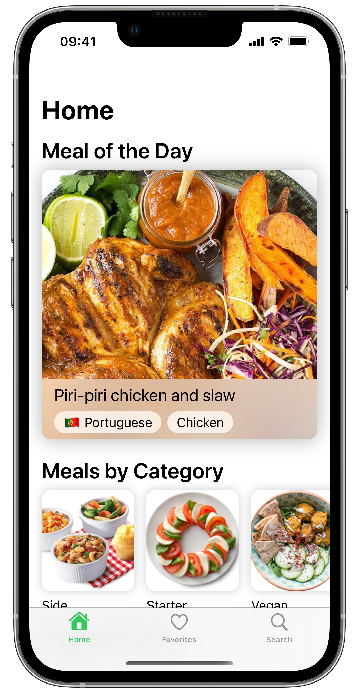
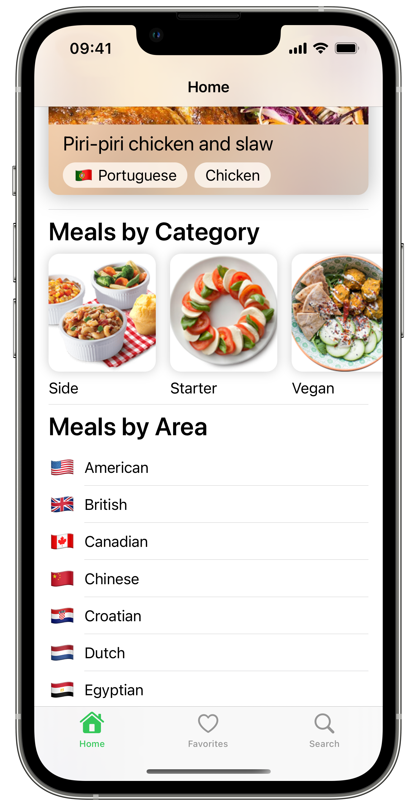
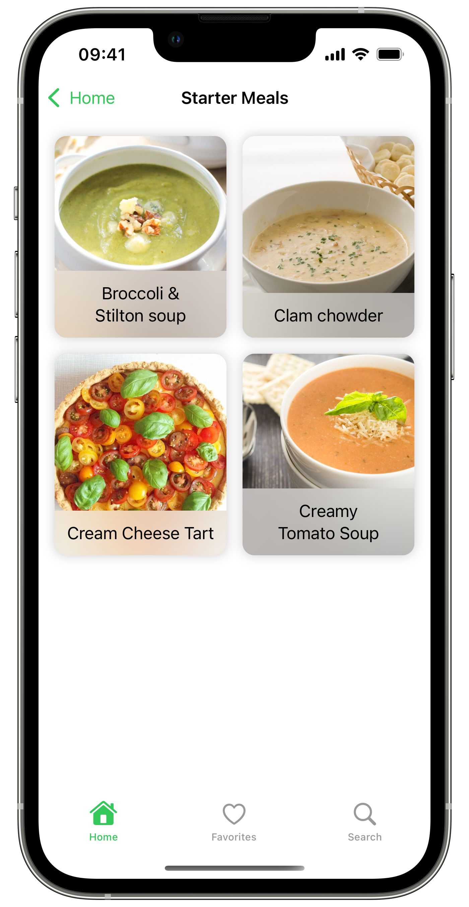
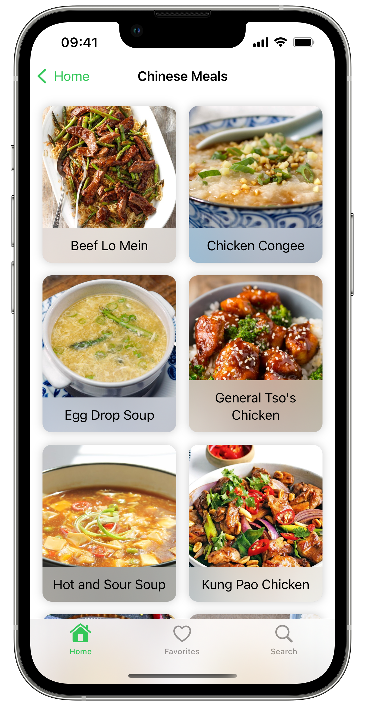
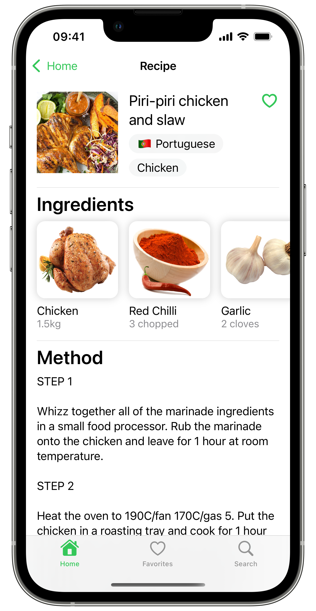
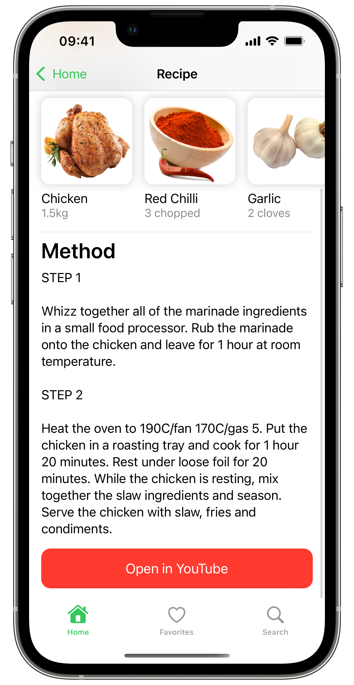
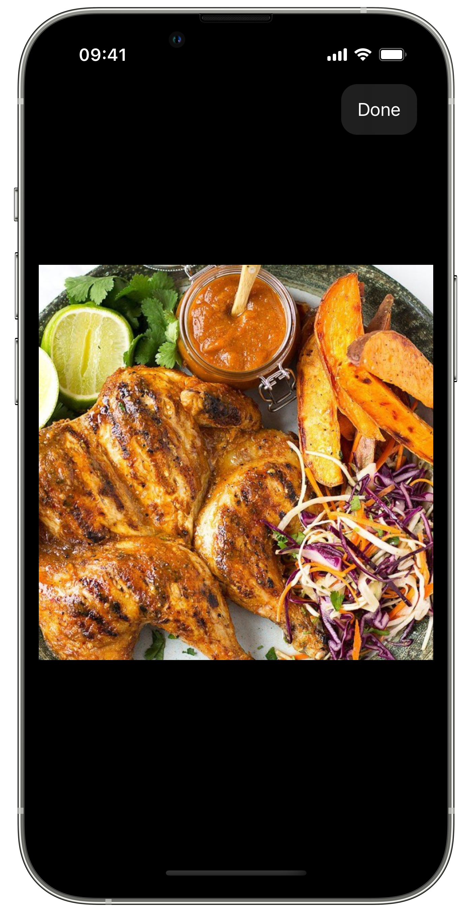
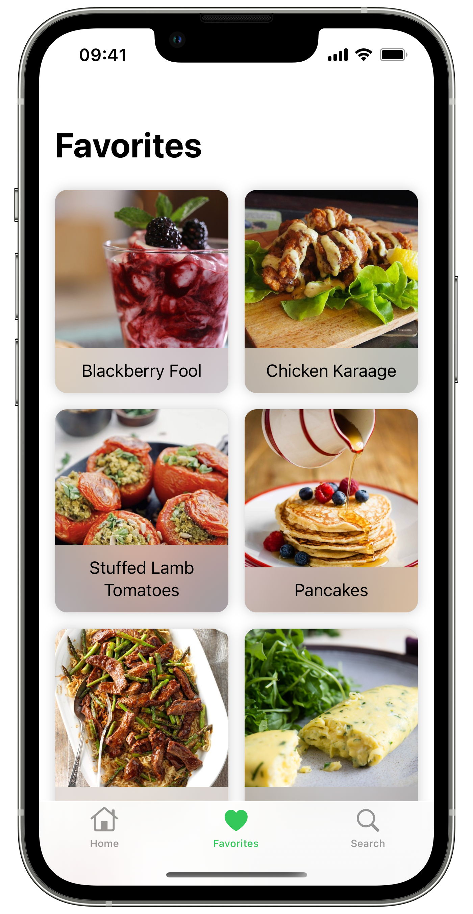
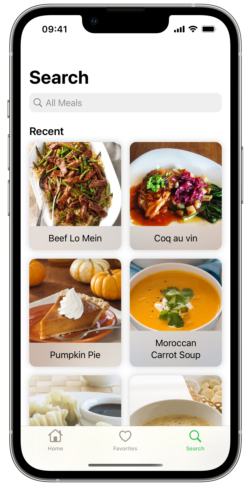
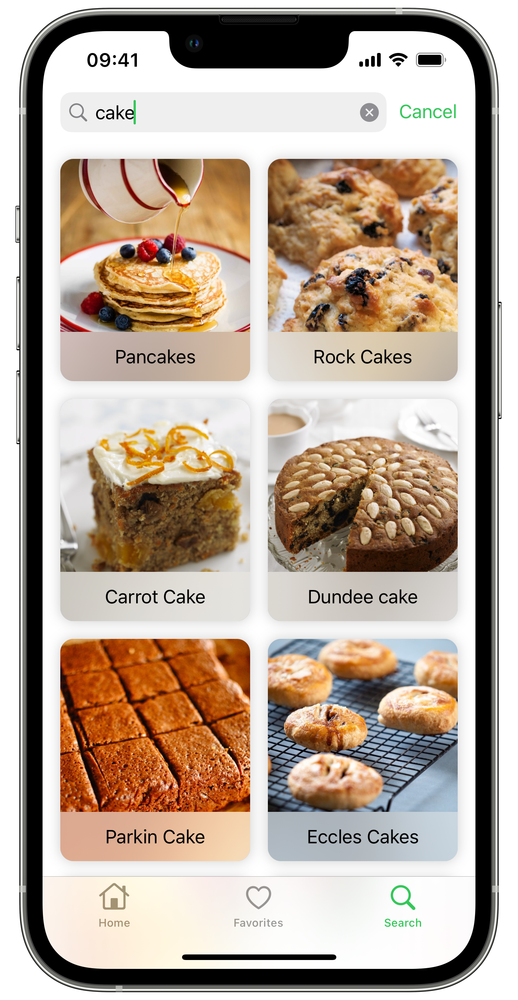

 
  
  
  
  <h1 align="center">Cookbook</h1>  
  

    Cookbook is an app that lets you look up recipes in TheMealDB.
  

## Features
- Get access to Meal of the Day and meal categories from the home screen

 

- Look up meals by category or origin area

 

- Get detailed cooking instructions paired with YouTube videos to help you follow the steps

  

- Mark recipes you like as favorite to get quick access to them through the 'Favorites' tab

- Search for specific meals by their name

 

## Requirements
- iOS 14.5+
- iPadOS 14.5+

## License

Distributed under the GPLv3 license. See `LICENSE.md` for more information.
